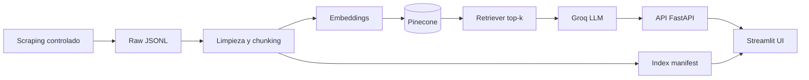

# BravoBot

BravoBot es un asistente universitario 24/7 para aspirantes de la I.U. Pascual Bravo. Está diseñado como un sistema RAG que recupera evidencia exclusivamente del contenido oficial del sitio público https://pascualbravo.edu.co/ y responde en español con tono institucional, claro y sin inventar datos.

## Arquitectura general



## Estructura del proyecto

```text
bravobot/
  app/
    api/
    ui/
    core/
    ingestion/
    rag/
    services/
    models/
    utils/
  data/
    raw/
    processed/
  docs/
  scripts/
  tests/
  web/
  .env.example
  .gitignore
  requirements.txt
  README.md
  render.yaml
  vercel.json
  Dockerfile
```

## Flujo end-to-end

1. `python -m scripts.scrape` descubre URLs relevantes, respeta `robots.txt`, aplica rate limiting y guarda documentos crudos en `data/raw/`.
2. `python -m scripts.process` limpia el texto, lo normaliza y lo convierte en chunks configurables.
3. `python -m scripts.index` genera embeddings, sube los vectores a Pinecone o al almacén local de desarrollo y escribe un manifiesto para la UI.
4. `uvicorn app.api.main:app` expone `POST /chat` y `GET /health`.
5. `streamlit run app/ui/streamlit_app.py` consume la API y muestra chat + dashboard.

## Requisitos previos

- Python 3.11+
- Acceso a internet para el scraping inicial
- Una cuenta de Groq si quieres respuestas generativas
- Una cuenta de Pinecone si quieres persistencia vectorial en nube

## Variables de entorno

Usa `.env.example` como base y completa al menos las claves de producción.

- `GROQ_API_KEY`: clave para el LLM de Groq
- `PINECONE_API_KEY`: clave de Pinecone
- `PINECONE_ENVIRONMENT`: compatibilidad si tu índice usa ese esquema
- `PINECONE_INDEX_NAME`: nombre del índice
- `PINECONE_NAMESPACE`: namespace para BravoBot
- `EMBEDDING_MODEL`: modelo de embeddings local
- `LLM_MODEL`: modelo Groq
- `APP_ENV`: `local`, `development`, `staging` o `production`

En desarrollo, si no defines Pinecone, el proyecto usa un vector store local para no bloquear la demo. En producción, configura Pinecone.

## Instalación local

```bash
python -m venv .venv
.venv\Scripts\activate
pip install -r requirements.txt
```

## Ejecución local

### 1. Scraping

```bash
python -m scripts.scrape
```

### 2. Procesamiento

```bash
python -m scripts.process
```

### 3. Indexación

```bash
python -m scripts.index
```

### 4. API

```bash
uvicorn app.api.main:app --reload --port 8000
```

### 5. UI Streamlit

```bash
streamlit run app/ui/streamlit_app.py
```

Si la UI está en otra máquina o contenedor, define `BRAVOBOT_API_URL` apuntando al backend.

## Estrategia anti-alucinación

BravoBot no responde fuera del dominio institucional y no inventa costos, requisitos ni fechas. El flujo de respuesta aplica tres barreras:

1. Retriever top-k con umbral mínimo de similitud.
2. Prompt del sistema restrictivo en `app/core/prompts/system_prompt.md`.
3. Mensaje de salida fijo cuando la evidencia es insuficiente:

> No encontré información oficial suficiente en las fuentes disponibles de Pascual Bravo para responder con certeza.

## Limitaciones actuales

- La indexación depende de que el sitio público exponga el contenido en HTML accesible.
- El modo generativo requiere `GROQ_API_KEY`.
- El dashboard usa una telemetría inicial simulada basada en los datos indexados; no incluye analítica histórica avanzada.

## Mejoras futuras

- Re-ranking con un modelo ligero adicional.
- Auditoría de citas más estricta por fragmento.
- Métricas de uso reales por sesión y categoría.
- Automatización programada de scraping incremental.

## Despliegue en Render

### API

1. Crea un servicio web usando `render.yaml`.
2. Define las variables secretas en el panel de Render.
3. Usa `uvicorn app.api.main:app --host 0.0.0.0 --port $PORT`.

Variables recomendadas:

- `APP_ENV=production`
- `GROQ_API_KEY`
- `PINECONE_API_KEY`
- `PINECONE_INDEX_NAME`
- `PINECONE_NAMESPACE`
- `BRAVOBOT_API_URL`

### Streamlit

1. Crea un segundo servicio web con `streamlit run app/ui/streamlit_app.py`.
2. Apunta `BRAVOBOT_API_URL` al backend.

## Despliegue en Vercel

BravoBot incluye una landing ligera en `web/index.html` y `vercel.json` para una presencia mínima del proyecto. Si quieres usar Vercel como frontend técnico, despliega esa landing o conecta una capa propia que consuma la API.

## Checklist de demo de 3 minutos

1. Mostrar el scraping y explicar que respeta robots.txt.
2. Mostrar `python -m scripts.process` e `python -m scripts.index`.
3. Abrir la UI de Streamlit y hacer una pregunta sobre admisiones o costos.
4. Enseñar las fuentes citadas por URL.
5. Preguntar algo fuera de contexto y mostrar la respuesta de no evidencia.

## Comandos de verificación

```bash
pytest -q
```

```bash
uvicorn app.api.main:app --reload
```
